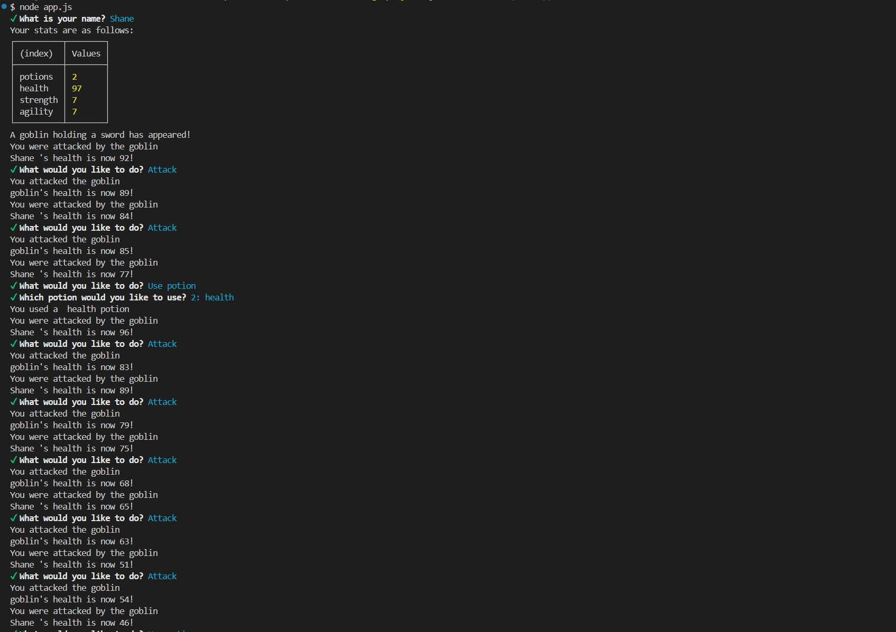

# Jest Another RPG

## Description

A command-line role-playing game (RPG) in which the user battles a series of enemies whose health and stats can be sustained by taking a potion. This game will create new objects using JavaScript constructor functions, and you’ll also implement basic code tests using the Jest framework.

## Requirements

For development, you will only need Node.js.

## Installation

### Node installation on Windows

Please visit [Official Node.js Website](https://nodejs.org/) and download the installer.
Also, be sure to have `git` available in your PATH, `npm` might need it (You can find git [here](https://git-scm.com/)).

To install all node modules and dependencies, please run the command. npm install

## Usage

### Demo: [Jest Another RPG](https://drive.google.com/file/d/1t4CUYDXCl6Zb46P42BkopclSI7h-5z6g/view)

## Technologies Used

- JavaScript
- Node.js
- Jest

## Contributions

- Shane Bramble-Wade

## Project Status

Project is: _completed_

## Contact

Created by [@kranniax](https://twitter.com/kranniax) - feel free to contact me!
